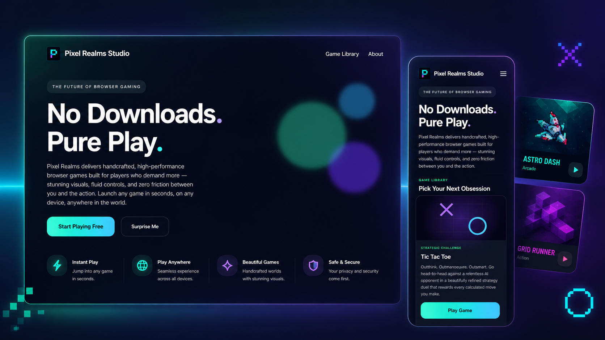

<div align="center">



<br/>

# ⬛ PIXEL REALMS STUDIO

### *No Downloads. Pure Play.*

<br/>

[](https://developer.mozilla.org/en-US/docs/Web/HTML)
[](https://developer.mozilla.org/en-US/docs/Web/CSS)
[](https://developer.mozilla.org/en-US/docs/Web/JavaScript)
[](#)

<br/>

[](#)
[](#game-library)
[](#)
[](#)

<br/>

> *A handcrafted browser gaming platform built with pixel-perfect precision*
> *zero installs, zero friction, pure adrenaline.*

</div>

---

<br/>

## 🌌 Overview

**Pixel Realms** is a premium browser-gaming showcase a fully self-contained, zero-dependency gaming hub housing multiple hand-engineered titles. Every frame, every transition, and every particle effect is authored from scratch in vanilla HTML, CSS, and JavaScript. No build tools. No frameworks. No compromises.

Built as a portfolio centrepiece by [**Laser Frame**](https://hassanireza.github.io/hassanireza/portfolio/Laser-frame/index.html), this project demonstrates that browser-native technologies when wielded with intent can produce experiences that rival app-store quality on any device, any screen, anywhere in the world.

<br/>

## ✨ Feature Highlights

| Feature | Detail |
|---|---|
| 🎮 **3 Playable Titles** | Neon Blocks, Tic Tac Toe, Neural Grid all launch instantly |
| 🎠 **Animated Game Carousel** | GPU-accelerated, depth-layered card carousel with auto-advance |
| 📱 **Fully Responsive** | Adaptive layouts and touch-swipe gestures across all breakpoints |
| 🌈 **Dynamic Backgrounds** | Animated radial gradients, noise texture overlays, floating orbs |
| ⚡ **Hardware-Accelerated** | CSS `will-change`, `transform`, and `backdrop-filter` throughout |
| 🎲 **Surprise Me** | One-click random game launcher for instant variety |
| 🖱️ **Hover-Aware Autoplay** | Carousel pauses on hover, resumes on leave no user friction |
| 🎨 **Custom Scrollbar** | Gradient-lit scrollbar with neon glow design down to the pixel |
| 🔤 **Dual Typeface System** | Inter × Space Grotesk engineered for legibility and character |
| 🌀 **Per-Card Animated Covers** | Each game card has a unique, bespoke animated cover illustration |

<br/>

## 🎮 Game Library

### ⬚ Neon Blocks *Arcade Experience*
> Stack, survive, and dominate.

A razor-sharp reimagining of the all-time classic block-stacking formula turbocharged with neon reactor visuals, tetromino animations, particle systems, and an addictive scoring engine. The animated cover features a pulsing reactor core with orbiting energy rings and floating particle emitters.

**Cover tech:** Reactor background drift · Rotating energy ring · Pulsing tetromino pieces · 8-particle floating system · Triple glow layers

---

### ✕ Tic Tac Toe *Strategic Challenge*
> Outthink. Outmanoeuvre. Outsmart.

A beautifully refined strategy duel against a relentless AI opponent. Purple-hued, light-swept cover with animated X and O symbols that drift on a geometric grid. Every move is a calculated duel.

**Cover tech:** Light sweep animation · Symbol float drift · Radial purple gradient · Frosted grid lines

---

### ◈ Neural Grid *Interactive Simulation*
> Set life in motion and watch it evolve.

Conway's Game of Life, reimagined as a hypnotic living simulation. Place cells, trigger chain reactions, and watch emergent complexity unfold in real time. Teal-toned cover with pulsing neon grid cells.

**Cover tech:** Neural drift animation · Pulse glow cycle · Neon cell highlighting · Radial glow bloom

<br/>

## 🗂️ Project Structure

```
pixel-realms/
│
├── index.html      # Landing page & carousel hub
├── style.css       # Full visual system animations, layout, theming
├── script.js       # Carousel engine, autoplay, touch/swipe logic
│
├── logoIcon.png      # Brand icon (nav + favicon)
├── assets/
│ └── pixelRealmsBanner.png # Repository banner
│
└── games/
  ├── neonBlocks/
  │ └── index.html    # Neon Blocks game
  ├── ticTacToe/
  │ └── index.html    # Tic Tac Toe game
  └── neuralGrid/
    └── index.html    # Neural Grid simulation
```

<br/>

## 🎨 Design System

### Colour Palette

| Role | Hex | Swatch |
|---|---|---|
| Background | `#050816` | ████ Deep Space |
| Accent Neon Green | `#67ffb7` | ████ Mint Plasma |
| Accent Electric Purple | `#7d67ff` | ████ Violet Core |
| Accent Ice Blue | `#59c3ff` | ████ Cryo Pulse |
| Text Primary | `#ffffff` | ████ Pure White |
| Text Secondary | `rgba(255,255,255,0.7)` | ████ Muted Star |

### Typography

```
Headlines  →  Space Grotesk   weight 700  (logo, nav brand)
Body   →  Inter      weight 300–800  (all copy, UI)
Labels   →  Inter      weight 500, letter-spacing: 2–3px (categories, tags)
```

### Animation Vocabulary

- **Orb Float** 18–24s sinusoidal drift, three independent axes
- **Reactor Pulse** 3s scale oscillation on the Neon Blocks cover core
- **Ring Orbit** continuous 360° rotation on the energy ring
- **Particle Float** staggered vertical rise with opacity fade
- **Light Sweep** 12s horizontal gloss pass across card covers
- **Background Drift** 35s slow parallax on cover gradients

<br/>

## ⚙️ Carousel Engine

The carousel is a custom-built, zero-library implementation with the following mechanics:

```js
// Depth layering active card at full scale, neighbours ghosted
transform: `translate(-50%, -50%) translateX(${offset * 95}%) scale(${active ? 1 : 0.85})`
opacity: active ? "1" : ".35"
zIndex:  cards.length - Math.abs(offset)

// Mobile single-card, full-opacity snap view
transform: `translate(-50%, -50%) scale(${active ? 1 : 0.9})`
opacity: active ? "1" : "0"
```

**Interaction model:**

- ⬅️ ➡️ Arrow buttons (hidden on mobile)
- 👆 Touch swipe 50px threshold left/right
- ⏱️ Autoplay 6s interval, pauses on `mouseenter`
- 🎲 Random jump `Surprise Me` button selects a random card's `href`
- 📐 Resize-aware `window.resize` triggers full layout recalculation

<br/>

## 🚀 Getting Started

No build step. No `npm install`. No configuration.

```bash
# 1. Clone the repository
git clone https://github.com/yourusername/pixel-realms.git

# 2. Open in a local server (recommended to avoid CORS on game assets)
npx serve .
# or
python -m http.server 8080

# 3. Open your browser
open http://localhost:8080
```

> ⚠️ Opening `index.html` directly via `file://` protocol may cause asset loading issues in some browsers. A local server is recommended.

<br/>

## 📱 Responsive Behaviour

| Breakpoint | Layout |
|---|---|
| `> 1024px` | Split hero (text + floating orbs) · Arrow navigation visible · Multi-depth carousel |
| `768px – 1024px` | Stacked hero · Arrows hidden · Touch swipe active |
| `< 768px` | Full-width single-card carousel · Compact nav · Centred panel cards |

<br/>

## 🧠 Engineering Decisions

**Why vanilla JS?**
Every kilobyte shipped is intentional. No React, no Vue, no Svelte just the platform. The result is sub-second load times with zero hydration overhead.

**Why CSS animations over JS animations?**
Compositor-thread animations (transform, opacity) never block the main thread. All motion in Pixel Realms runs on the GPU, keeping the UI at a locked 60fps regardless of JavaScript activity.

**Why no external icon libraries?**
The navigation arrows are inline SVG zero extra HTTP requests, zero render-blocking, and fully styleable via CSS `stroke`.

**Why `backdrop-filter`?**
The frosted-glass card panels use `backdrop-filter: blur(28px)` for depth without opaque backgrounds preserving the layered luminance of the gradient system beneath.

<br/>

## 🏗️ Built With

[](https://developer.mozilla.org/en-US/docs/Web/HTML)
[](https://developer.mozilla.org/en-US/docs/Web/CSS)
[](https://developer.mozilla.org/en-US/docs/Web/JavaScript)
[](https://fonts.google.com/)

<br/>

## 👤 Author

<div align="center">

Designed & engineered by

### **Laser Frame**

[](https://hassanireza.github.io/pixelRealms/)

</div>

<br/>

## 📄 License

```
© 2026 Pixel Realms · All Rights Reserved
This project is a personal portfolio piece and is not open for redistribution.
```

---

<div align="center">

*Crafted with precision. Played with passion.*

**⬛ PIXEL REALMS STUDIO ⬛**

</div>
